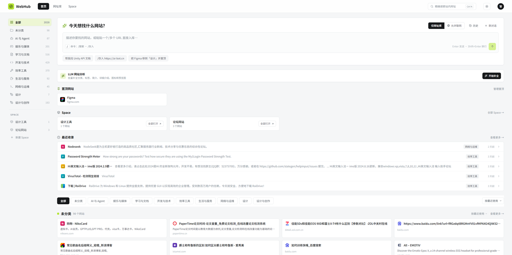
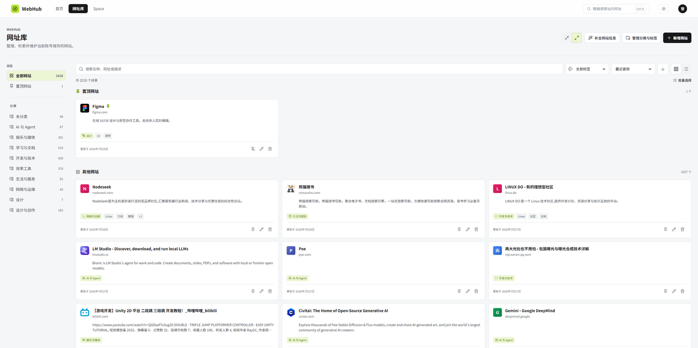
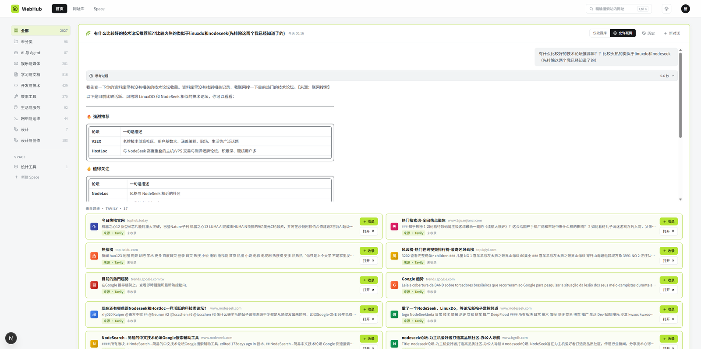
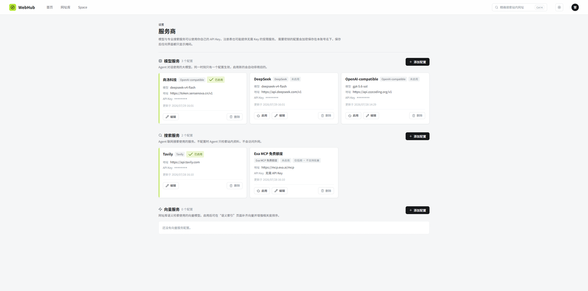
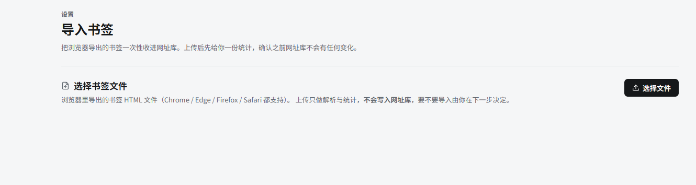
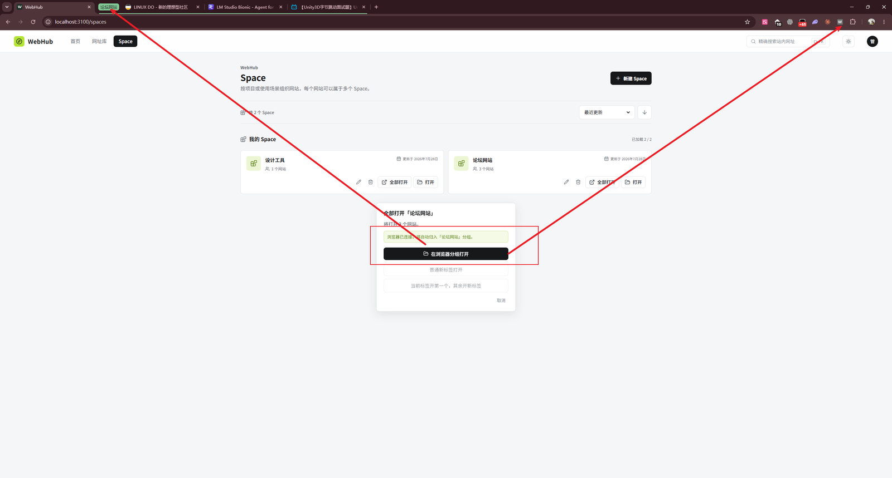
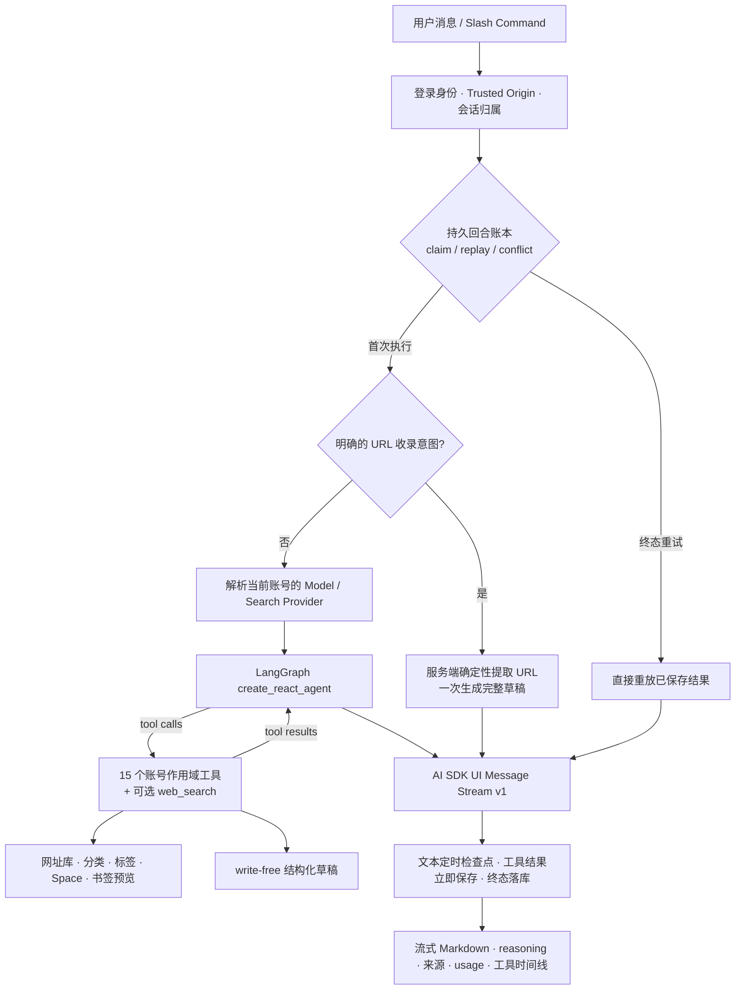
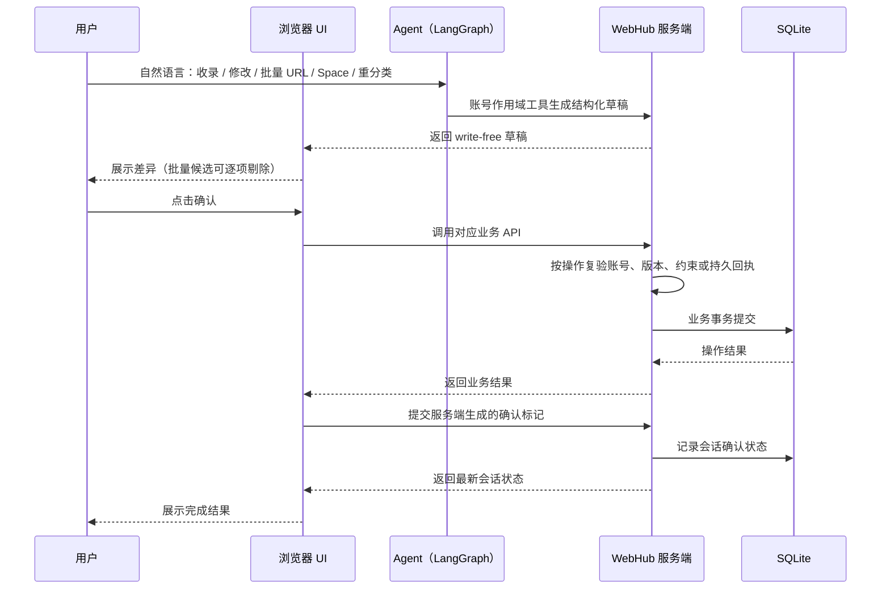
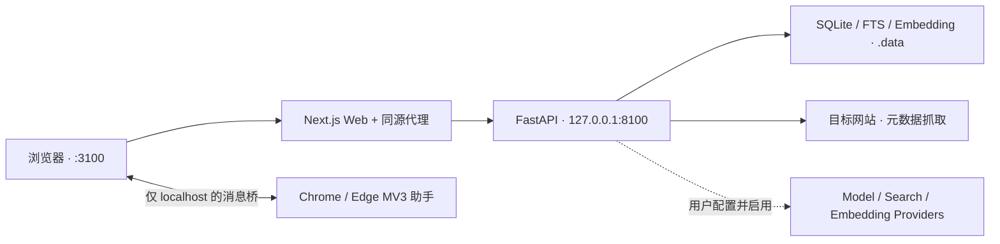
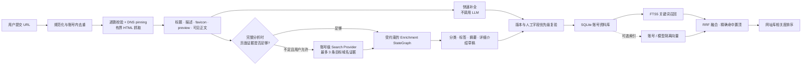

<div align="center">


# WebHub

**Agent First 的个人网址知识中枢**

把“存过但找不到”的网址，变成可对话、可检索、可解释、可确认执行的个人知识资产。

[](https://nextjs.org/)
[](https://react.dev/)
[](https://www.typescriptlang.org/)
[](https://www.python.org/)
[](https://fastapi.tiangolo.com/)
[](https://www.sqlite.org/)
[](https://langchain-ai.github.io/langgraph/)
[](./PROGRESS.md)

[产品亮点](#为什么-webhub) · [界面预览](#界面预览) · [Agent 架构](#agent-搭建框架) · [技术方案](#技术亮点与先进方案) · [快速开始](#快速开始) · [项目状态](#项目状态与限制)

</div>

> [!IMPORTANT]
> WebHub 当前定位是 **Windows 主机上的本地 / 可信家庭局域网 MVP**：网站可供局域网设备访问，FastAPI 只监听本机回环地址。
> 它不是能直接暴露到公网的 SaaS 或生产部署方案，也没有做公网安全加固。

---

## 为什么 WebHub

WebHub 不是在传统网址导航页旁边附加一个聊天框，而是让 Agent 成为网站收录、理解、检索与整理的主要入口，
同时保留高效的可视化浏览和手动管理能力。

| 设计重点 | WebHub 的实现 | 带来的价值 |
| --- | --- | --- |
| **Agent 原生工作流** | 自然语言贯通站内查找、网站推荐、单站/批量收录、资料修改、Space 批处理与全库重分类。明确的 URL 收录命令走服务端确定性快路径，不依赖模型逐个循环。 | Agent 不只是问答层，而是真正参与资料治理；确定性任务也不会为了“智能感”牺牲完整性。 |
| **读自由，写确认** | 账号作用域工具可以读取资料库，但 `propose_*` 工具只生成结构化草稿。用户确认后才调用业务 API，并按操作使用账号校验、乐观锁、唯一约束或持久操作回执保护写入。 | 模型可以积极规划，但不能静默改库；高风险动作始终可见、可审阅、可拒绝。 |
| **Local-first + BYO Provider** | 账号、网址、会话、向量与任务状态保存在本机 SQLite；模型、搜索和 Embedding 都使用每个账号自己的 Provider 配置。 | 不绑定单一模型厂商；没有 Provider 时仍可使用关键词检索、网页元数据补全和手动管理。 |
| **面向真实故障设计** | Agent 回合有幂等账本、租约、心跳、检查点与终态重放；混合检索可降级；批量补全有持久快照、恢复与 Provider 熔断。 | 刷新、重试、限流或部分外部服务失效时，系统仍能给出可解释的状态，而不是重复扣费或留下半完成结果。 |

## 目录

- [为什么 WebHub](#为什么-webhub)
- [界面预览](#界面预览)
- [核心特性](#核心特性)
- [Agent 搭建框架](#agent-搭建框架)
- [Agent 写操作如何生效](#agent-写操作如何生效)
- [架构](#架构)
- [技术亮点与先进方案](#技术亮点与先进方案)
- [快速开始](#快速开始)
- [配置](#配置)
- [Provider 与联网边界](#provider-与联网边界)
- [Chrome / Edge Space 分组助手](#chrome--edge-space-分组助手)
- [本地数据与隐私](#本地数据与隐私)
- [开发与验证](#开发与验证)
- [项目状态与限制](#项目状态与限制)
- [项目文档](#项目文档)
- [开发约定](#开发约定)
- [许可证](#许可证)

## 界面预览

### 首页 · 分类总览与 Agent 入口

一屏之内看清网址总数、分类分布与置顶站点；顶部 Agent 输入框可以直接提问或收录网址，网站分析工具可选择不调用 LLM 的快速补全或有界的完整分析。



### 网址库 · 分类、标签与批量管理

网格 / 列表双视图，支持分类与标签筛选、相关度排序、拖拽自定义顺序、批量选择删除、静默自动分页，
也可用纯本地规则排查全库相似网站，逐组选择主网站并在二次确认后清理。



### Agent 对话 · 自然语言查找与整理

流式 Markdown 回答，附带经服务端筛选的来源链接、工具时间线、可折叠推理与 Provider 返回的 Token 用量；写操作先出草稿，确认后才落库。



### 第三方能力接入 · 模型 / 搜索 / 向量服务商

模型、搜索、Embedding 三类 Provider 各自独立配置；密钥加密入库、只回掩码，连接测试与模型列表都走用户自己的账号配置。



### 批量导入浏览器书签

上传 Chrome / Edge / Firefox / Safari 导出的书签 HTML，先看解析、去重与分类预览，确认后再写入。



### Space · 一键打开为浏览器标签组

把一组网站收进 Space；配合可选的 Chrome / Edge 助手，一次生成同名的浏览器原生标签组。



## 核心特性

| 你要完成的事 | WebHub 提供的流程 |
| --- | --- |
| **建立网址库** | 手动或批量收录 URL，自动抓取站点元数据，按分类、共享标签、置顶状态与自定义顺序管理；站点卡片优先进入站内详情页。可在不调用 LLM 或外部网络的前提下排查全库相似网站，由用户逐组决定全部保留或保留一个主网站。 |
| **导入浏览器书签** | 上传 Chrome、Edge、Firefox、Safari 等浏览器导出的 Netscape Bookmark HTML，先查看解析、去重与分类预览，再确认写入。 |
| **用 Agent 查找和整理** | Agent 默认仅使用当前账号的网址库；用户显式切到“允许联网”后仍先查库，只有不足或明确需要实时资料时才搜索。回答支持流式 Markdown、经服务端筛选的来源链接、工具时间线、推理折叠、停止与历史恢复。写操作先生成草稿，只有用户确认后才落库。 |
| **检索和补全资料** | 网址库相关度排序融合关键词与可选向量召回；可按需执行不调用 LLM 的网页元数据补全、每批最多 100 个网站的 LLM 完整分析、语义索引补全和 LLM 全库重分类。没有可用 Provider 时仍可快速补全、关键词检索与手动管理。 |
| **用 Space 组织任务** | 创建、重命名和排序 Space，批量加入或移出网站；可选 Chrome / Edge 助手能把一个 Space 打开为浏览器原生标签组。 |

## Agent 搭建框架

WebHub 采用“**LangGraph 推理循环 + WebHub 业务运行时 + 独立资料补全图**”的双 Agent 架构。
模型负责理解和规划，但账号边界、回合可靠性、协议转换、草稿确认与数据库提交都由服务端掌控。



| 层 | 实现 | 责任边界 |
| --- | --- | --- |
| **主对话 Agent** | LangGraph `create_react_agent` 的 `agent ↔ tools` ReAct 循环 | 选择站内工具、组合回答、按需调用联网搜索；每回合绑定当前账号启用的 Provider。 |
| **WebHub Agent Runtime** | FastAPI 路由、Provider binding、turn ledger、stream adapter | 在模型调用前固定账号与会话，处理幂等、租约、心跳、检查点、终态回放，并把 LangGraph 事件翻译成 AI SDK 流协议。 |
| **账号作用域工具面** | 15 个基础工具，另有可选 `web_search` | 覆盖站内查找、详情、taxonomy、推荐卡、单站/批量收录草稿、网站修改、书签预览、Space 批处理和全库重分类；模型参数中没有可伪造的 `user_id`。 |
| **网站资料补全 Agent** | 独立显式 StateGraph：`model → tools → model` | 只通过四个强类型、write-free 工具生成分类、标签、摘要和详细介绍草稿；最多 5 轮、每轮最多 6 次工具调用。 |

> [!NOTE]
> 主对话图刻意不挂 LangGraph checkpointer。可见会话历史和恢复状态统一来自 WebHub 自有消息表与回合账本，
> 因而支持部分输出保存和终态重放，但不宣称能从崩溃前的某个 LangGraph 节点继续执行。

## Agent 写操作如何生效

WebHub 的 Agent 工具不直接写业务表。Human-in-the-loop 在产品层完成：模型生成草稿，浏览器展示差异，
用户确认后才调用普通业务 API；它不是 LangGraph `interrupt()` / `Command(resume=...)`。



1. 用户用自然语言提出收录、修改、批量 URL、Space 或重分类任务。
2. 服务端用固定账号作用域读取数据并生成结构化草稿，不直接执行写入。
3. 前端展示将要发生的变化；批量候选可在确认前调整。
4. 用户确认后，浏览器调用对应业务 API；服务端按操作使用乐观锁、唯一约束、单事务或持久回执保护结果。
5. 业务结果成功返回后，浏览器再提交服务端生成的确认标记，把结果记录进会话历史；这里不宣称业务写入与会话标记是一个跨 API 事务。
6. 已完成、已拒绝或已过期的草稿不会从历史记录重新变成可执行状态。

## 架构



| 层 | 技术栈 |
| --- | --- |
| **Web** | Next.js 16、React 19、TypeScript、Vercel AI SDK、Tailwind CSS 4、Motion、Streamdown |
| **API** | Python 3.13、FastAPI、LangGraph、SQLAlchemy、Alembic；认证、Agent、书签、网址库、Provider、搜索、Space 同属一个业务服务 |
| **数据** | 本地 SQLite + 全文检索 + 可重建站点向量；业务数据始终按账号隔离 |
| **浏览器助手** | 原生 JavaScript MV3 扩展，只负责本机 WebHub 与浏览器标签组之间的受限桥接 |

```text
apps/
├── web/                    Next.js 界面、同源 API 代理与流式上传入口
└── browser-extension/      可选的 Chrome / Edge Space 分组助手
services/api/
├── src/webhub/             FastAPI 业务模块（auth / library / bookmarks / chat / agent / providers / spaces / search）
├── alembic/                SQLite schema 迁移
└── tests/                  后端合同与行为测试
packages/contracts/         跨栈流式协议夹具
skills/                     书签导入与分类操作说明
docs/screenshots/           README 界面截图
```

## 技术亮点与先进方案

| 方案 | 关键实现 | 为什么重要 |
| --- | --- | --- |
| **可重放的 Agent 回合账本** | 稳定 `turn_id` 与请求摘要绑定；60 秒租约、15 秒心跳、2 秒文本检查点，工具结果立即强制保存；CAS fencing 阻止过期执行器覆盖终态。 | 同一请求重试可直接重放，不会重复调用模型或重复写消息；停止、异常和过期也有明确终态。 |
| **完整且有界的生成式 UI 流协议** | 后端实现 AI SDK UI Message Stream v1，统一传输文本、reasoning、工具调用/结果、可信 `source-url`、Provider usage、TTFT 与总耗时；响应禁止代理缓冲。推荐 artifact、持久工具结果和来源 parts 分别受明确容量约束；最终推荐与 `source-url` 只有在持久化接纳后才进入实时流。 | 前端得到的不是一段字符串，而是一条可恢复、可观测、可渲染为卡片与时间线的结构化事件流；超限会明确报错或留下截断摘要。较早已实时显示的可重建只读中间结果在聚合超限时可能只以摘要进入历史/重放，因此不承诺整个 live 序列与 replay 逐事件完全相同。 |
| **同消息来源信任** | 新回合使用推荐 manifest v3；正文与 reasoning 的外部链接必须精确匹配同一消息的受信 `source-url`。Provider URL 在工具与 runner 双层规范化、过滤和去重；合法 v2 历史只读兼容，旧模型知识 URL 再做启发式点击过滤。 | 模型不能凭记忆把任意网址提升为可信来源；私网、凭据、敏感参数、编码/非规范数字 IPv4、反斜杠与畸形 URL 不会进入新的可点击来源。 |
| **关键词永不失效的混合检索** | SQLite FTS5 是基线；可选 Embedding 召回与关键词结果通过 RRF 融合，精确名称或 URL 命中强制置顶，稳定规则打破同分。 | 没有 Provider、索引为空或语义调用失败时静默降级到关键词，不让增强能力成为单点故障。 |
| **个人规模的轻量向量层** | 向量按账号和模型隔离，以 little-endian float32 保存在 SQLite，手写余弦相似度；内容摘要精确识别模型/文本变化，最多扫描 20,000 条。 | 对几千条个人网址避免引入第二套向量数据库，向量与主库一起备份，且始终可由站点资料重建。 |
| **SSRF-safe 网页取证** | 每次重定向重新校验，DNS 解析后固定连接 IP，同时保留原 Host/TLS SNI；禁环境代理和自动跳转，只接受 HTML，流式读取上限 2 MiB，不执行 JavaScript。 | 用户提交的任意 URL 不会因为一次 `302`、DNS rebinding 或超大响应绕过边界。 |
| **受约束的 LLM 资料补全** | 分类、标签、20-50 字摘要、100-300 字介绍分别由四个强类型工具产出；页面内容与搜索摘要一律视为低权限数据，最终提交前重验版本、taxonomy 和人工字段优先级。 | LLM 只生成内存草稿，不能把提示注入、过期分类 ID 或并发旧快照直接写进数据库。 |
| **可恢复的有界后台任务** | 全库补全使用不可变目标快照、run/item lease、心跳、固定分母进度和启动恢复；全局分析并发 4、后台最多占 3、LLM 并发 1，并带 Retry-After 冷却与连续失败熔断。 | 批量任务刷新或重启后可恢复，同时始终给交互请求保留网络槽，也不会在 Provider 故障时形成重试风暴。 |
| **确定性书签与相似治理** | 书签预览、同站聚类和全库相似扫描使用本地 URL 规则，不调用 LLM、Embedding 或外部网络；决策绑定持久快照、全库指纹和逐站版本，执行时单事务复验。 | 可在零模型成本下清理重复项；页面陈旧或任一成员变化时整批拒绝，避免误删和部分合并。 |
| **按账号隔离的 Provider 安全边界** | Model / Search / Embedding 三类配置独立启用；API Key 使用 AES-256-GCM，AAD 绑定账号、配置、类型和厂商；运行前重新做 HTTPS、DNS、私网与 Fake-IP 校验，当轮关闭联网时不解密搜索密钥。 | 密文不能跨账号或配置搬用；Provider 地址变化、DNS rebinding 和 Clash/Mihomo Fake-IP 都不会被当作普通公网目标放行。 |
| **本地账号与会话防护** | 密码使用 Argon2id，未知用户名执行 dummy hash；原始 Session 只存在于 HttpOnly Cookie，数据库只存 SHA-256 摘要；写请求执行可信 Origin 校验。 | 本地部署不等于放弃认证边界，账号枚举、Cookie 落库和跨站写请求都被显式约束。 |

<details>
<summary><strong>核心实现索引</strong></summary>

| 主题 | 代码入口 |
| --- | --- |
| Agent 图、运行时与回合账本 | [`graph.py`](./services/api/src/webhub/agent/graph.py) · [`langgraph_runner.py`](./services/api/src/webhub/agent/langgraph_runner.py) · [`turns.py`](./services/api/src/webhub/agent/turns.py) |
| Agent 工具与确认状态 | [`tools.py`](./services/api/src/webhub/agent/tools.py) · [`drafts.py`](./services/api/src/webhub/chat/service/drafts.py) |
| 跨栈流协议 | [`ui_message_stream.py`](./services/api/src/webhub/streaming/ui_message_stream.py) · [`packages/contracts`](./packages/contracts) |
| 混合检索与向量 | [`service.py`](./services/api/src/webhub/search/service.py) · [`fusion.py`](./services/api/src/webhub/search/fusion.py) · [`vectors.py`](./services/api/src/webhub/search/vectors.py) |
| 安全抓取与资料补全 | [`fetcher.py`](./services/api/src/webhub/ingestion/fetcher.py) · [`site_enrichment.py`](./services/api/src/webhub/agent/site_enrichment.py) · [`backfill.py`](./services/api/src/webhub/ingestion/backfill.py) |
| Provider 密钥与出站目标 | [`security.py`](./services/api/src/webhub/providers/security.py) · [`targets.py`](./services/api/src/webhub/providers/targets.py) · [`provider_binding.py`](./services/api/src/webhub/agent/provider_binding.py) |
| 本地相似治理 | [`bookmarks/similarity.py`](./services/api/src/webhub/bookmarks/similarity.py) · [`library/similarity.py`](./services/api/src/webhub/library/similarity.py) |

</details>

### 从 URL 到可检索知识



> [!IMPORTANT]
> 混合向量召回当前只用于网址库带搜索词时的“相关度”排序。Agent 的 `search_library` 仍走关键词路径，
> 不应把它描述成已接入语义检索的 Agentic RAG；当前向量实现也定位于个人规模，而不是海量 ANN 检索。

## 快速开始

### 环境要求

| 依赖 | 版本 |
| --- | --- |
| 操作系统 | Windows（当前开发与支持目标） |
| Node.js | `24.x`（`.node-version` 固定 24.18.0） |
| pnpm | `11.1.3` |
| Python | `3.13.x`（`services/api/.python-version` 固定） |
| uv | 最新版 |

### 安装

```powershell
pnpm install --frozen-lockfile
uv sync --project services/api --frozen
```

### 启动

```powershell
pnpm dev
```

`pnpm dev` 会先执行数据库迁移，再并行启动 Next.js 与 FastAPI。启动后访问：

| 入口 | 地址 |
| --- | --- |
| 本机网站 | `http://localhost:3100` |
| 局域网设备 | `http://<Windows 主机局域网 IP>:3100` |
| API 文档 | `http://127.0.0.1:8100/api/docs` |
| 健康检查 | `http://localhost:3100/api/health` |

首次使用时在网站中注册本地账号。网址库、分类、标签、Space 和关键词搜索不要求模型 Provider；需要 Agent、LLM 分析或语义索引时，再到「服务商」设置页添加对应配置。

> [!WARNING]
> Windows 首次运行 Node.js 时如弹出防火墙提示，只允许受信任的专用网络。不要把 `8100` 端口暴露到局域网，也不要绕过网站的同源代理直接访问业务 API。

## 配置

开发环境使用默认值即可启动，不要求创建 `.env`。需要覆盖配置时，以 [根环境变量样例](./.env.example) 和 [Web 环境变量样例](./apps/web/.env.example) 为准。

| 变量 | 默认值 / 用途 |
| --- | --- |
| `WEBHUB_DATA_DIR` | `.data`；数据库、Provider 主密钥和书签源文件的根目录。 |
| `WEBHUB_DATABASE_URL` | 未设置时使用 `<WEBHUB_DATA_DIR>/main.sqlite3`。 |
| `WEBHUB_API_INTERNAL_URL` | `http://127.0.0.1:8100`；Next.js 访问 FastAPI 的内部地址。 |
| `WEBHUB_ALLOWED_HOSTS` | 为网站入口增加明确允许的主机名或别名。 |
| `WEBHUB_SESSION_COOKIE_SECURE` | 可信局域网 HTTP 默认 `false`；只有网站实际通过 HTTPS 提供时才设为 `true`。 |
| `WEBHUB_PROVIDER_MASTER_KEY` | 生产环境必填的 32 字节 Base64 主密钥；开发环境未设置时会在数据目录生成并持久化。 |

修改 `WEBHUB_API_INTERNAL_URL` 后，必须在相同配置下重新执行 `pnpm build`，再启动已构建网站。

## Provider 与联网边界

WebHub 不内置任何供应商密钥，模型访问一律走 per-account 的 Provider 配置。

| 类型 | 用途 | 内置注册表 |
| --- | --- | --- |
| **模型** | Agent 回答、工具选择、LLM 站点分析 | OpenAI、DeepSeek、通义千问、Kimi、Ollama、OpenAI-compatible |
| **搜索** | 原网页证据不足时的补证；仅在账号启用且当轮选择「允许联网」时调用 | Tavily、Jina、Exa、Exa MCP 免费额度 |
| **Embedding** | 网址库语义索引与相关度排序 | OpenAI、通义千问、Ollama、OpenAI-compatible |

- 搜索查询会发送给所选服务商；连接测试也可能执行一次真实查询并消耗额度，因此必须由用户显式点击。
- Agent 默认是“仅网址库”。用户显式切换为“允许联网”后仍必须先查网址库，`web_search` 只能复用本轮
  最近一次站内检索的完全相同规范化 query；不能由模型换词后绕过站内优先语义。
- 服务端会启发式阻止模型把最近站内结果的名称、URL、摘要、介绍、分类或标签片段擅自拼入外发 query，
  但这不是 DLP，不能保证识别自然语言中所有私密信息。向搜索 Provider 发送查询前仍应由用户判断内容。
- **Exa MCP 免费额度** 是无需 API Key 的低频选择，不承诺可用性，也不参与全库批量回填；稳定或批量使用应配置自己的搜索 Provider。
- 未配置、索引为空或调用失败时，检索会降级为关键词结果，而不是报错阻塞。

> [!NOTE]
> Provider API Key 以 AES-256-GCM 密文保存在数据库中，接口只回掩码 `********`。开发环境生成的主密钥与数据库同在数据目录，因此能读取整套数据目录的人仍可解密这些密钥；这不是远程密钥托管或硬件级隔离。

## Chrome / Edge Space 分组助手

普通网页不能可靠创建浏览器原生标签组。若需要把 Space 一键打开为命名的绿色标签组，可在当前浏览器配置文件中侧载助手：

1. Chrome 打开 `chrome://extensions`，Edge 打开 `edge://extensions`。
2. 开启「开发者模式」，选择「加载已解压的扩展程序」。
3. 从仓库根目录选择 `apps/browser-extension`。
4. 刷新 `http://localhost:3100` 或 `http://127.0.0.1:3100` 中的 WebHub 页面。

Chrome 和 Edge 需要分别安装。助手只接受本机 `localhost:3100` / `127.0.0.1:3100` 页面，使用局域网 IP 打开的客户端页面不能连接它；未连接时 WebHub 会明确降级为普通标签页打开。单次最多处理 100 个 HTTP(S) 地址。

扩展清单只申请 `storage` 与 `tabGroups` 权限，不读取标签页正文、浏览历史、Cookie 或账号密钥。为了在响应丢失后安全恢复，网页与扩展会在本机保存 Space 名称、URL 集合和操作回执，最长保留 7 天。

## 本地数据与隐私

| 数据 | 默认位置 | 注意事项 |
| --- | --- | --- |
| 账号、网址库、会话和设置 | `.data/main.sqlite3` | 密码使用 Argon2id；数据库只保存登录 Session 的 SHA-256 摘要，不保存原始 Cookie。 |
| Provider 主密钥 | `.data/provider-master.key` | 开发环境自动生成。丢失后，数据库中已有的 Provider API Key 将无法解密。 |
| 浏览器书签源文件 | `.data/bookmark-imports/.../source.html` | 原始导出可能包含私有地址和敏感查询参数；当前没有面向用户的快照清理入口。 |
| 本机环境变量 | `.env` | 可包含主密钥和部署配置，已被 Git 忽略，不得提交。 |

使用外部模型或搜索 Provider 时，完成请求所需的消息、上下文或查询会发送给对应服务商。站点分析会访问用户提交的目标网站；远程 favicon 和 preview 当前由浏览器直接加载，图片源会看到客户端请求。

默认 SQLite 环境需要做主机级备份时，先停止 WebHub，再把整个 `.data` 目录作为一组保存，包括数据库的 WAL/SHM 文件、Provider 主密钥和书签源文件。该备份包含敏感数据，应按凭据备份保护；它不等同于尚未实现的产品级导出 / 恢复功能。

## 开发与验证

完整本地质量门禁：

```powershell
pnpm check
```

该命令依次执行前后端 lint、前端类型检查、前后端测试和 Next.js 构建。也可以分别执行：

| 命令 | 作用 |
| --- | --- |
| `pnpm lint` | 前端 ESLint + 后端 Ruff |
| `pnpm typecheck` | 前端 `tsc --noEmit` |
| `pnpm test` | 前端 `node --test` + 后端 `pytest` |
| `pnpm build` | Next.js 生产构建 |

截至 2026-08-30 · Q41，本轮自动化证据如下；新增功能必须带测试，已确认基线只能涨不能降：

| 范围 | 结果 | 说明 |
| --- | --- | --- |
| 前端完整测试 | **222 / 222** | Q41 当前完整基线。 |
| Q41 后端聚焦回归 | **127 / 127** | 覆盖 normalization、batch_sites、web_search、agent_tools、langgraph_runner 与 turns。 |
| Q41 后端完整测试 | **708 / 708** | 本轮完整 pytest 回归通过。 |
| Q41 lint / typecheck / build / 根级 `pnpm check` | **通过** | 完整 ESLint/Ruff、`tsc --noEmit`、Next.js 生产构建（静态页 12/12）与组合门禁均通过。 |
| 数据库迁移 | **无新增迁移** | 开发库此前已确认位于 `20260731_0019 (head)`；Q41 未接触 `.data`。 |

> [!NOTE]
> 上述结果来自本轮离线 `pnpm check`；未调用真实 Provider、未运行 Playwright，也未接触真实书签或 `.data`。

验证构建后在本机运行：

```powershell
pnpm build
pnpm start
```

`pnpm start` 仍遵守单 API worker、FastAPI loopback 和可信局域网边界；它不是公网部署流程。

## 项目状态与限制

**最新快照：2026-08-30 · Q41。** Provider 配置、Agent 增改查、书签导入、网页抓取、批量入库、
自定义排序、Space 管理、混合检索与 LLM 全库重分类九条核心链路已建成。最近迭代重点已经从“功能能否跑通”
进入可靠性、批量数据治理、真实进度反馈与跨浏览器交互的收口阶段。

| 里程碑 | 已交付的关键能力 | 当前验收状态 |
| --- | --- | --- |
| **Q26 · Agent 可靠性与来源** | 持久 `turn_id`、租约/心跳/检查点、四态重放、经校验的 `source-url`、reasoning、Token、工具时间线与停止收口。 | 该迭代全仓门禁通过；后续 Q32 又完成后端 655 项完整回归。 |
| **Q27 / Q32 · Provider 与出站安全** | 精确 Provider 错误码、Clash/Mihomo Fake-IP 诊断；网页资源在全量 Fake-IP 时通过独立公网 DNS 恢复真实地址后继续执行同一 SSRF 策略。 | 真实 `www.smzdm.com` 非 LLM 抓取已通过；完整真实 Provider / 浏览器矩阵仍需用户验收。 |
| **Q28 · Agent 完整结果** | 大结果与模型上下文分流，完整结果冻结为服务端 artifact；前端 12 条分页并支持历史恢复。 | 代码与静态专项检查完成；真实 87 条全量结果页面待用户复核。 |
| **Q29 / Q31 · 相似数据治理** | 书签同站整理、全库相似扫描、持久决策快照、分页多选、全库 fingerprint、执行前 CAS 与单事务关系迁移。 | 迁移与专项回归完成；真实数据上的删除/合并决策刻意留给用户执行。 |
| **Q30 / Q35 · 可恢复分析任务** | 快速补全与 LLM 完整分析双模式、固定目标快照、Provider 熔断、单站真实阶段进度、刷新/重启恢复。 | 后端相关 88 / 88；小批真实 Provider 页面流程待验收。 |
| **Q33-Q36 · 容量与交互收口** | 10k/50k/100k 书签解析预览审计、全窗口拖放、分页位置保持、reasoning 自动开合，以及六处主题化可搜索选择器。 | 100k 仅证明可到达解析预览，不代表完整可靠导入；Q35/Q36 新交互待真实 Chrome 的视觉、键盘与移动端验收。 |
| **Q39-Q41 · Agent 检索与来源硬化** | 默认仅网址库、显式联网且同 query 先查库；未指定/全量与显式 N 条由服务端冻结；manifest v3 同消息来源白名单、Provider URL 双层过滤、旧模型知识兼容过滤，以及 256/384/64 KiB 持久化预算。 | 前端 222/222、后端 708/708、完整 lint/typecheck、Next.js 静态页 12/12 与根级 `pnpm check` 已通过。真实浏览器和受控假 Provider 安全矩阵待验收。 |

部分近期交互仍需要在真实 Chrome / Edge、可用模型与搜索 Provider、Exa MCP 和浏览器扩展环境中完成人工验收。
这些“代码完成”和“真实环境实测”在 [PROGRESS.md](./PROGRESS.md) 中始终分开记录。

**当前明确未完成的范围：**

- 数据导出与 WebHub 自有备份导入；
- 书签 occurrence 到最终 Site 的长期来源台账；
- Agent 对话内直接确认书签导入（当前需转到「导入书签」页面）；
- 分类图标选择器和确定性的近义标签合并；
- 100,000 条书签与 Site 的完整性能门禁；
- 多 API worker、Docker / NAS / Linux 常驻部署和公网安全加固；
- 受控的远程 favicon / preview 代理缓存。

网址库页面的“相关度”排序会使用可选 Embedding，但 Agent 的站内检索只使用关键词路径。Agent 的
未指定数量/全量结果和显式 N 条结果按确定性 query 相关度排序并服务端冻结；只有没有明确数量的主观有限
精选 `include_all=false` 按 `updated desc` 取候选。向量层最多扫描 20,000 条记录，定位于个人规模而非
海量数据，不能把 Agent 描述成已接入 Embedding RAG。

Agent 推荐 artifact 单回合上限为 256 KiB；持久工具 `sources` 与 `source-url` parts 的预算分别是
384 KiB 和 64 KiB。完整清单超过 256 KiB 会返回 `result_set_too_large`，不会自动变成任意规模分页。
105 条/9 页与 22 条/2 页只是回归样例，不证明 100,000 条或任意规模的 Agent 结果交付；当前没有对应的
服务端结果集分页 API。合法 v2 推荐历史仍可只读显示，旧 `llm推荐` 标为“模型知识（未实时验证）”；
旧模型 URL/favicon 与已持久化 `web_search` 来源会在重放时重新校验。兼容过滤会拒绝畸形 IPv6、非规范
数字 IPv4、组播地址、单标签主机、`home.arpa` 等私有/保留后缀、反斜杠、凭据和敏感参数；JSON 中
孤立 surrogate 或非有限数值会 fail closed，Provider 的流式 text/reasoning 则在入流和入库前统一做
UTF-8 安全投影。该过滤仍只是安全启发式，不是来源证明或 DLP。

新站写库本身是持久的，但当分析队列完全占满或 API 在执行前退出时，本次即时 LLM 分析意图尚不能保证
恢复；只有首页显式启动的全库补全任务具备持久恢复语义。

准确的已完成项、自动化证据、人工验收项和下一步以 [当前进度快照](./PROGRESS.md) 为准。

未来准备公网或 SaaS 上线时，必须先阅读 [迭代队列中的 SaaS-TODO 专项准入清单](./ITERATION_QUEUE.md)，
先确定邀请制公网 Alpha、公开 Beta 或正式商业 SaaS 阶段，再补齐对应安全、数据、运维、配额与合规门禁。
直接开放现有端口不属于公网部署完成。

## 项目文档

| 文档 | 内容 |
| --- | --- |
| [PRD.md](./PRD.md) | 产品范围、用户流程与非目标 |
| [PROGRESS.md](./PROGRESS.md) | 已验证能力、已知问题与验收基线（每轮更新） |
| [ITERATION_QUEUE.md](./ITERATION_QUEUE.md) | 下一项开发的唯一调度入口，含未来公网 SaaS 上线专项 TODO |
| [AGENTS.md](./AGENTS.md) | 项目目录、状态文档和敏感数据规则 |
| [IMPLEMENTATION_PLAN.md](./IMPLEMENTATION_PLAN.md) | 冻结的早期架构基线，仅作背景参考 |
| [skills/import-browser-bookmarks](./skills/import-browser-bookmarks/SKILL.md) | 书签导入合同与离线预览流程 |
| [skills/bookmark-classification-operator](./skills/bookmark-classification-operator/SKILL.md) | 书签分类操作边界 |

## 开发约定

开始修改前先阅读 [AGENTS.md](./AGENTS.md)，从 [ITERATION_QUEUE.md](./ITERATION_QUEUE.md) 领取工作，并在提交前运行 `pnpm check`。功能状态变化必须同步到 [PROGRESS.md](./PROGRESS.md)；根 README 只保留稳定的项目入口信息。

不可动摇的约束（完整清单见 `ITERATION_QUEUE.md` 文末）：

- 绝不硬编码任何 LLM 供应商或 API Key，模型访问一律走 per-account 的 providers 模块；
- 完整密钥只回掩码，厂商异常原文绝不透出到客户端；
- Agent 工具强制服务端账号作用域，不直接写库，一律 propose → 人工确认；
- 非 Ollama 的 base URL 必须 HTTPS 并通过 SSRF 校验；
- 前端只用设计令牌，圆角全站 ≤8px，图标只用 lucide-react。

## 许可证

本仓库当前没有 `LICENSE` 文件，包清单也标记为 `private`。除非维护者补充明确许可证，否则不要假定代码已获得复制、分发或商业使用授权。
