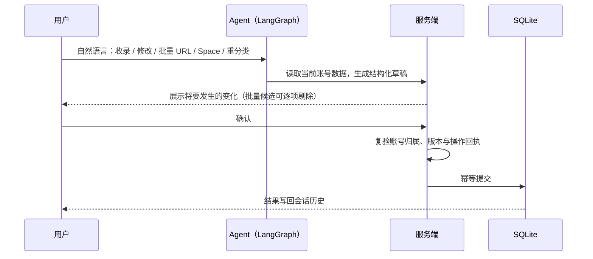
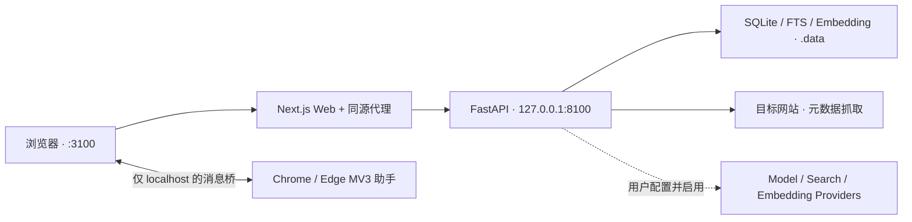

<div align="center">


# WebHub

**Agent First 的个人网址知识中枢**

把散落各处的网址收进账号隔离的资料库，再用自然语言、分类、标签、搜索与 Space 完成整理和复用。

[](https://nextjs.org/)
[](https://react.dev/)
[](https://www.typescriptlang.org/)
[](https://www.python.org/)
[](https://fastapi.tiangolo.com/)
[](https://www.sqlite.org/)
[](https://langchain-ai.github.io/langgraph/)
[](./PROGRESS.md)

[界面预览](#界面预览) · [核心特性](#核心特性) · [快速开始](#快速开始) · [配置](#配置) · [项目状态](#项目状态与限制) · [文档](#项目文档)

</div>

> [!IMPORTANT]
> WebHub 当前定位是 **Windows 主机上的本地 / 可信家庭局域网 MVP**：网站可供局域网设备访问，FastAPI 只监听本机回环地址。
> 它不是能直接暴露到公网的 SaaS 或生产部署方案，也没有做公网安全加固。

---

## 目录

- [界面预览](#界面预览)
- [核心特性](#核心特性)
- [Agent 写操作如何生效](#agent-写操作如何生效)
- [架构](#架构)
- [快速开始](#快速开始)
- [配置](#配置)
- [Provider 与联网边界](#provider-与联网边界)
- [Chrome / Edge Space 分组助手](#chrome--edge-space-分组助手)
- [本地数据与隐私](#本地数据与隐私)
- [开发与验证](#开发与验证)
- [项目状态与限制](#项目状态与限制)
- [项目文档](#项目文档)
- [开发约定](#开发约定)
- [许可证](#许可证)

## 界面预览

### 首页 · 分类总览与 Agent 入口

一屏之内看清网址总数、分类分布与置顶站点；顶部 Agent 输入框可以直接提问、收录网址或触发全库补全任务。


### 网址库 · 分类、标签与批量管理

网格 / 列表双视图，支持分类与标签筛选、相关度排序、拖拽自定义顺序、批量选择删除，以及静默自动分页。


### Agent 对话 · 自然语言查找与整理

流式 Markdown 回答，附带真实来源、工具时间线、可折叠推理与真实 Token 用量；写操作先出草稿，确认后才落库。


### 第三方能力接入 · 模型 / 搜索 / 向量服务商

模型、搜索、Embedding 三类 Provider 各自独立配置；密钥加密入库、只回掩码，连接测试与模型列表都走用户自己的账号配置。


### 批量导入浏览器书签

上传 Chrome / Edge / Firefox / Safari 导出的书签 HTML，先看解析、去重与分类预览，确认后再写入。


### Space · 一键打开为浏览器标签组

把一组网站收进 Space；配合可选的 Chrome / Edge 助手，一次生成同名的浏览器原生标签组。


## 核心特性

| 你要完成的事 | WebHub 提供的流程 |
| --- | --- |
| **建立网址库** | 手动或批量收录 URL，自动抓取站点元数据，按分类、共享标签、置顶状态与自定义顺序管理；站点卡片优先进入站内详情页。 |
| **导入浏览器书签** | 上传 Chrome、Edge、Firefox、Safari 等浏览器导出的 Netscape Bookmark HTML，先查看解析、去重与分类预览，再确认写入。 |
| **用 Agent 查找和整理** | Agent 默认使用当前账号的网址库；回答支持流式 Markdown、真实来源、工具时间线、推理折叠、停止与历史恢复。写操作先生成草稿，只有用户确认后才落库。 |
| **检索和补全资料** | 网址库相关度排序融合关键词与可选向量召回；可按需执行站点分析、语义索引补全和 LLM 全库重分类。没有可用 Provider 时保留关键词检索与手动管理。 |
| **用 Space 组织任务** | 创建、重命名和排序 Space，批量加入或移出网站；可选 Chrome / Edge 助手能把一个 Space 打开为浏览器原生标签组。 |

## Agent 写操作如何生效

WebHub 的 Agent 不直接写数据库。所有写入都要经过一次显式确认：



1. 用户用自然语言提出收录、修改、批量 URL、Space 或重分类任务。
2. 服务端读取当前账号的数据并生成结构化草稿，不直接执行写入。
3. 前端展示将要发生的变化；批量候选可在确认前调整。
4. 用户确认后，服务端再次校验账号归属、版本与操作回执，再以幂等方式提交。
5. 结果写回会话历史；未完成或已过期的草稿不能从历史记录再次执行。

## 架构



| 层 | 技术栈 |
| --- | --- |
| **Web** | Next.js 16、React 19、TypeScript、Vercel AI SDK、Tailwind CSS 4、Motion、Streamdown |
| **API** | Python 3.13、FastAPI、LangGraph、SQLAlchemy、Alembic；认证、Agent、书签、网址库、Provider、搜索、Space 同属一个业务服务 |
| **数据** | 本地 SQLite + 全文检索 + 可重建站点向量；业务数据始终按账号隔离 |
| **浏览器助手** | 原生 JavaScript MV3 扩展，只负责本机 WebHub 与浏览器标签组之间的受限桥接 |

```text
apps/
├── web/                    Next.js 界面、同源 API 代理与流式上传入口
└── browser-extension/      可选的 Chrome / Edge Space 分组助手
services/api/
├── src/webhub/             FastAPI 业务模块（auth / library / bookmarks / chat / agent / providers / spaces / search）
├── alembic/                SQLite schema 迁移
└── tests/                  后端合同与行为测试
packages/contracts/         跨栈流式协议夹具
skills/                     书签导入与分类操作说明
docs/screenshots/           README 界面截图
```

## 快速开始

### 环境要求

| 依赖 | 版本 |
| --- | --- |
| 操作系统 | Windows（当前开发与支持目标） |
| Node.js | `24.x`（`.node-version` 固定 24.18.0） |
| pnpm | `11.1.3` |
| Python | `3.13.x`（`services/api/.python-version` 固定） |
| uv | 最新版 |

### 安装

```powershell
pnpm install --frozen-lockfile
uv sync --project services/api --frozen
```

### 启动

```powershell
pnpm dev
```

`pnpm dev` 会先执行数据库迁移，再并行启动 Next.js 与 FastAPI。启动后访问：

| 入口 | 地址 |
| --- | --- |
| 本机网站 | `http://localhost:3100` |
| 局域网设备 | `http://<Windows 主机局域网 IP>:3100` |
| API 文档 | `http://127.0.0.1:8100/api/docs` |
| 健康检查 | `http://localhost:3100/api/health` |

首次使用时在网站中注册本地账号。网址库、分类、标签、Space 和关键词搜索不要求模型 Provider；需要 Agent、LLM 分析或语义索引时，再到「服务商」设置页添加对应配置。

> [!WARNING]
> Windows 首次运行 Node.js 时如弹出防火墙提示，只允许受信任的专用网络。不要把 `8100` 端口暴露到局域网，也不要绕过网站的同源代理直接访问业务 API。

## 配置

开发环境使用默认值即可启动，不要求创建 `.env`。需要覆盖配置时，以 [根环境变量样例](./.env.example) 和 [Web 环境变量样例](./apps/web/.env.example) 为准。

| 变量 | 默认值 / 用途 |
| --- | --- |
| `WEBHUB_DATA_DIR` | `.data`；数据库、Provider 主密钥和书签源文件的根目录。 |
| `WEBHUB_DATABASE_URL` | 未设置时使用 `<WEBHUB_DATA_DIR>/main.sqlite3`。 |
| `WEBHUB_API_INTERNAL_URL` | `http://127.0.0.1:8100`；Next.js 访问 FastAPI 的内部地址。 |
| `WEBHUB_ALLOWED_HOSTS` | 为网站入口增加明确允许的主机名或别名。 |
| `WEBHUB_SESSION_COOKIE_SECURE` | 可信局域网 HTTP 默认 `false`；只有网站实际通过 HTTPS 提供时才设为 `true`。 |
| `WEBHUB_PROVIDER_MASTER_KEY` | 生产环境必填的 32 字节 Base64 主密钥；开发环境未设置时会在数据目录生成并持久化。 |

修改 `WEBHUB_API_INTERNAL_URL` 后，必须在相同配置下重新执行 `pnpm build`，再启动已构建网站。

## Provider 与联网边界

WebHub 不内置任何供应商密钥，模型访问一律走 per-account 的 Provider 配置。

| 类型 | 用途 | 内置注册表 |
| --- | --- | --- |
| **模型** | Agent 回答、工具选择、LLM 站点分析 | OpenAI、DeepSeek、通义千问、Kimi、Ollama、OpenAI-compatible |
| **搜索** | 原网页证据不足时的补证；仅在账号启用且当轮选择「允许联网」时调用 | Tavily、Jina、Exa、Exa MCP 免费额度 |
| **Embedding** | 网址库语义索引与相关度排序 | OpenAI、通义千问、Ollama、OpenAI-compatible |

- 搜索查询会发送给所选服务商；连接测试也可能执行一次真实查询并消耗额度，因此必须由用户显式点击。
- **Exa MCP 免费额度** 是无需 API Key 的低频选择，不承诺可用性，也不参与全库批量回填；稳定或批量使用应配置自己的搜索 Provider。
- 未配置、索引为空或调用失败时，检索会降级为关键词结果，而不是报错阻塞。

> [!NOTE]
> Provider API Key 以 AES-256-GCM 密文保存在数据库中，接口只回掩码 `********`。开发环境生成的主密钥与数据库同在数据目录，因此能读取整套数据目录的人仍可解密这些密钥；这不是远程密钥托管或硬件级隔离。

## Chrome / Edge Space 分组助手

普通网页不能可靠创建浏览器原生标签组。若需要把 Space 一键打开为命名的绿色标签组，可在当前浏览器配置文件中侧载助手：

1. Chrome 打开 `chrome://extensions`，Edge 打开 `edge://extensions`。
2. 开启「开发者模式」，选择「加载已解压的扩展程序」。
3. 从仓库根目录选择 `apps/browser-extension`。
4. 刷新 `http://localhost:3100` 或 `http://127.0.0.1:3100` 中的 WebHub 页面。

Chrome 和 Edge 需要分别安装。助手只接受本机 `localhost:3100` / `127.0.0.1:3100` 页面，使用局域网 IP 打开的客户端页面不能连接它；未连接时 WebHub 会明确降级为普通标签页打开。单次最多处理 100 个 HTTP(S) 地址。

扩展清单只申请 `storage` 与 `tabGroups` 权限，不读取标签页正文、浏览历史、Cookie 或账号密钥。为了在响应丢失后安全恢复，网页与扩展会在本机保存 Space 名称、URL 集合和操作回执，最长保留 7 天。

## 本地数据与隐私

| 数据 | 默认位置 | 注意事项 |
| --- | --- | --- |
| 账号、网址库、会话和设置 | `.data/main.sqlite3` | 密码使用 Argon2id；数据库只保存登录 Session 的 SHA-256 摘要，不保存原始 Cookie。 |
| Provider 主密钥 | `.data/provider-master.key` | 开发环境自动生成。丢失后，数据库中已有的 Provider API Key 将无法解密。 |
| 浏览器书签源文件 | `.data/bookmark-imports/.../source.html` | 原始导出可能包含私有地址和敏感查询参数；当前没有面向用户的快照清理入口。 |
| 本机环境变量 | `.env` | 可包含主密钥和部署配置，已被 Git 忽略，不得提交。 |

使用外部模型或搜索 Provider 时，完成请求所需的消息、上下文或查询会发送给对应服务商。站点分析会访问用户提交的目标网站；远程 favicon 和 preview 当前由浏览器直接加载，图片源会看到客户端请求。

默认 SQLite 环境需要做主机级备份时，先停止 WebHub，再把整个 `.data` 目录作为一组保存，包括数据库的 WAL/SHM 文件、Provider 主密钥和书签源文件。该备份包含敏感数据，应按凭据备份保护；它不等同于尚未实现的产品级导出 / 恢复功能。

## 开发与验证

完整本地质量门禁：

```powershell
pnpm check
```

该命令依次执行前后端 lint、前端类型检查、前后端测试和 Next.js 构建。也可以分别执行：

| 命令 | 作用 |
| --- | --- |
| `pnpm lint` | 前端 ESLint + 后端 Ruff |
| `pnpm typecheck` | 前端 `tsc --noEmit` |
| `pnpm test` | 前端 `node --test` + 后端 `pytest` |
| `pnpm build` | Next.js 生产构建 |

测试基线：**前端 175 项 / 后端 561 项**，新增功能必须带测试，基线只能涨不能降。

验证构建后在本机运行：

```powershell
pnpm build
pnpm start
```

`pnpm start` 仍遵守单 API worker、FastAPI loopback 和可信局域网边界；它不是公网部署流程。

## 项目状态与限制

核心代码已覆盖 Provider 配置、Agent 读写草稿、书签导入、网页抓取、批量入库、自定义排序、Space 管理、混合检索和 LLM 重分类，全仓自动门禁（lint / 类型 / 测试 / 构建）当前全绿。部分近期交互仍需要在真实 Chrome / Edge、可用模型与搜索 Provider、Exa MCP 和浏览器扩展环境中完成人工验收。

**当前明确未完成的范围：**

- 数据导出与 WebHub 自有备份导入；
- 书签 occurrence 到最终 Site 的长期来源台账；
- Agent 对话内直接确认书签导入（当前需转到「导入书签」页面）；
- 分类图标选择器和确定性的近义标签合并；
- 100,000 条书签与 Site 的完整性能门禁；
- 多 API worker、Docker / NAS / Linux 常驻部署和公网安全加固；
- 受控的远程 favicon / preview 代理缓存。

网址库的「相关度」排序会使用可选 embedding，但 Agent 的站内检索当前仍使用关键词路径。新站写库本身是持久的；当分析队列完全占满或 API 在执行前退出时，本次即时 LLM 分析意图尚不能保证恢复。

准确的已完成项、自动化证据、人工验收项和下一步以 [当前进度快照](./PROGRESS.md) 为准。

## 项目文档

| 文档 | 内容 |
| --- | --- |
| [PRD.md](./PRD.md) | 产品范围、用户流程与非目标 |
| [PROGRESS.md](./PROGRESS.md) | 已验证能力、已知问题与验收基线（每轮更新） |
| [ITERATION_QUEUE.md](./ITERATION_QUEUE.md) | 下一项开发的唯一调度入口 |
| [AGENTS.md](./AGENTS.md) | 项目目录、状态文档和敏感数据规则 |
| [IMPLEMENTATION_PLAN.md](./IMPLEMENTATION_PLAN.md) | 冻结的早期架构基线，仅作背景参考 |
| [skills/import-browser-bookmarks](./skills/import-browser-bookmarks/SKILL.md) | 书签导入合同与离线预览流程 |
| [skills/bookmark-classification-operator](./skills/bookmark-classification-operator/SKILL.md) | 书签分类操作边界 |

## 开发约定

开始修改前先阅读 [AGENTS.md](./AGENTS.md)，从 [ITERATION_QUEUE.md](./ITERATION_QUEUE.md) 领取工作，并在提交前运行 `pnpm check`。功能状态变化必须同步到 [PROGRESS.md](./PROGRESS.md)；根 README 只保留稳定的项目入口信息。

不可动摇的约束（完整清单见 `ITERATION_QUEUE.md` 文末）：

- 绝不硬编码任何 LLM 供应商或 API Key，模型访问一律走 per-account 的 providers 模块；
- 完整密钥只回掩码，厂商异常原文绝不透出到客户端；
- Agent 工具强制服务端账号作用域，不直接写库，一律 propose → 人工确认；
- 非 Ollama 的 base URL 必须 HTTPS 并通过 SSRF 校验；
- 前端只用设计令牌，圆角全站 ≤8px，图标只用 lucide-react。

## 许可证

本仓库当前没有 `LICENSE` 文件，包清单也标记为 `private`。除非维护者补充明确许可证，否则不要假定代码已获得复制、分发或商业使用授权。

